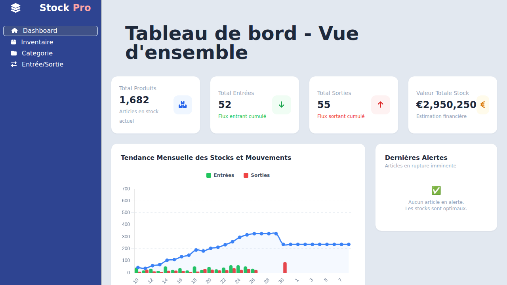
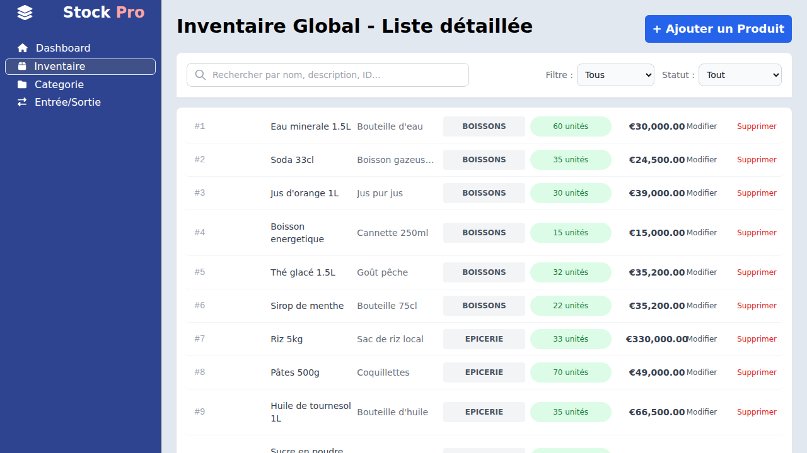
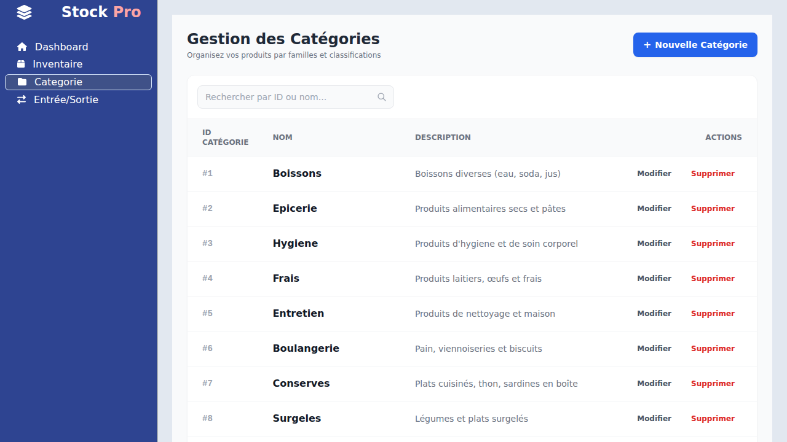
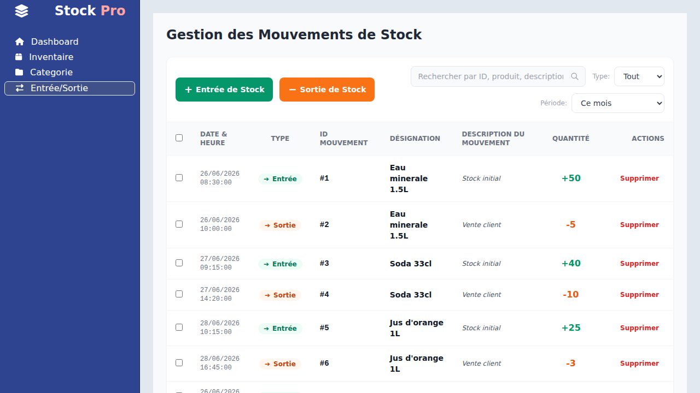

# 📦 StockPro - Application de Gestion de Stock

StockPro est une application complète, moderne et intuitive de gestion de stock. Conçue pour simplifier le suivi en temps réel des produits, des catégories et des flux d'entrées/sorties de marchandises, elle offre une expérience utilisateur fluide grâce à une interface Angular élégante et un backend Spring Boot performant et robuste.

---

## 🚀 Fonctionnalités Clés et Captures d'Écran

L'application propose plusieurs modules spécialisés pour une gestion complète de vos entrepôts :

### 1. Tableau de Bord (Dashboard)
Le Tableau de Bord offre une vue d'ensemble instantanée des indicateurs clés (KPIs) : total des produits, flux cumulé d'entrées et de sorties, ainsi que la valeur financière estimée de votre stock. Un graphique interactif permet également de suivre la tendance mensuelle de vos stocks et mouvements, tandis qu'un encart dédié affiche les alertes de rupture imminente.



---

### 2. Gestion de l'Inventaire (Produits)
Le module d'Inventaire liste en détail l'ensemble des produits enregistrés avec leur désignation, description, catégorie associée, quantité en stock et valeur totale. Vous disposez de filtres rapides (par catégorie et par statut de stock) ainsi que d'une barre de recherche dynamique pour retrouver instantanément un produit, le modifier ou le supprimer.



---

### 3. Gestion des Catégories
Pour une organisation rigoureuse, ce module permet de structurer vos produits en catégories claires et personnalisées. Vous pouvez visualiser, créer de nouvelles catégories, les modifier ou les supprimer en toute simplicité.



---

### 4. Mouvements de Stock (Entrées/Sorties)
Ce module enregistre en temps réel l'ensemble des flux d'entrées et de sorties de marchandises. Il permet d'effectuer un suivi précis de chaque mouvement pour éviter toute erreur de comptabilité physique ou financière de vos stocks.



---

## 🛠️ Architecture du Projet

Le projet est divisé en deux parties principales :
*   **Backend** : Une API REST développée en Java avec **Spring Boot (v3.3.4)**, utilisant une base de données embarquée **H2** (les données sont persistées dans `./data/stockdb`).
*   **Frontend** : Une application web moderne développée en **Angular (v18.2.x)**, stylisée avec **Tailwind CSS** et utilisant des graphiques interactifs avec **Chart.js** / **ng2-charts**.

---

## 💻 Instructions d'Installation et de Démarrage

### ☕ 1. Lancement du Backend (Java JAR)

Le backend est fourni sous la forme d'un fichier `.jar` exécutable précompilé nommé `gestion-stock.jar` situé à la racine du dépôt.

#### Prérequis
*   Avoir **Java 21** (ou version supérieure) installé sur votre machine. Vous pouvez vérifier votre version de Java à l'aide de la commande suivante :
    ```bash
    java -version
    ```

#### Commande de lancement
Pour lancer le serveur de l'API REST du backend, ouvrez un terminal à la racine du projet et exécutez la commande :
```bash
java -jar gestion-stock.jar
```

*   **Port par défaut** : Le serveur démarrera sur le port `8080`.
*   **Base de données H2** : La console H2 est accessible à l'adresse [http://localhost:8080/h2-console](http://localhost:8080/h2-console).
*   **Fichiers de données** : La base de données utilise le chemin `jdbc:h2:file:./data/stockdb` et se configure automatiquement avec le fichier d'initialisation `data.sql` présent à la racine.

---

### 🅰️ 2. Lancement du Frontend (Angular)

Le frontend est une application Angular nécessitant un environnement d'exécution Node.js.

#### Prérequis
*   Avoir **Node.js** (v18.x ou v20.x de préférence) et **npm** installés sur votre machine.

#### Installation des dépendances
Pour installer l'ensemble des paquets nécessaires au bon fonctionnement de l'application, exécutez la commande suivante à la racine du projet :
```bash
npm install --legacy-peer-deps
```
*(L'option `--legacy-peer-deps` est recommandée pour résoudre d'éventuels conflits de dépendances de packages secondaires).*

#### Commande de démarrage
Une fois l'installation terminée, vous pouvez démarrer le serveur de développement local à l'aide d'Angular CLI ou directement via npm :

```bash
npm start
```
ou
```bash
npx ng serve
```

*   **Port de l'application** : Une fois compilée, l'application est accessible depuis votre navigateur à l'adresse [http://localhost:4200/](http://localhost:4200/).
*   **Rechargement à chaud (Hot-Reload)** : Toute modification apportée au code source frontend rechargera automatiquement la page dans le navigateur.

---

## 🧪 Tests du Projet

Vous pouvez exécuter les tests unitaires du frontend configurés avec Karma & Jasmine à l'aide de la commande :
```bash
npm test
```
